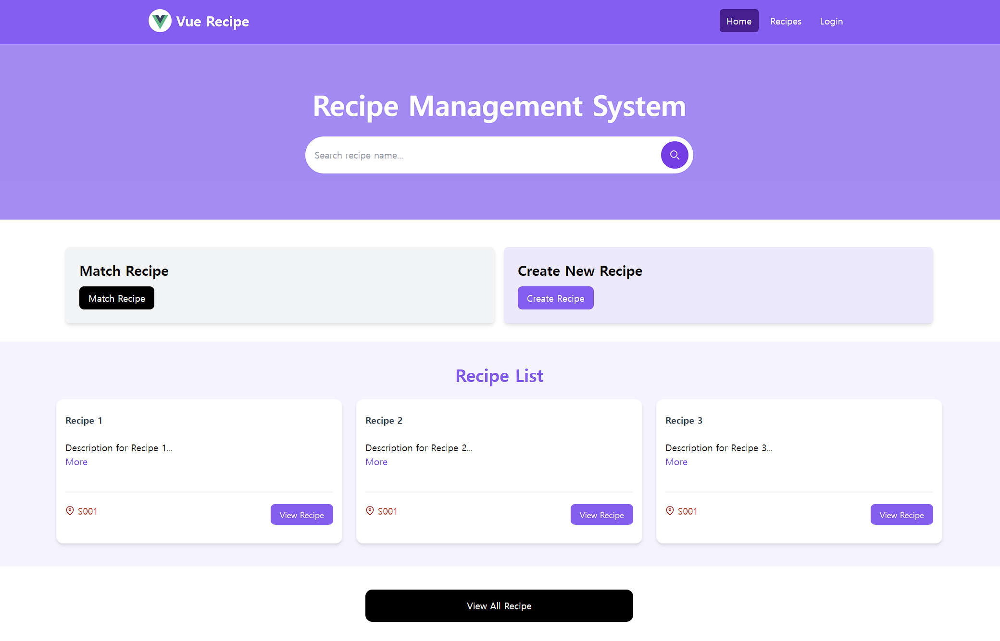

# Recipe Management System (RMS)

Recipe Management System(RMS)는 사용자가 레시피를 생성하고, 해당 레시피의 파라미터 값을 EAP로 전달할 수 있는 웹 애플리케이션입니다. 
이 프로젝트는 프론트엔드에 Vue.js를 사용하고, 백엔드 API 서비스는 ASP.NET Core Web Application을 통해 개발되었습니다.

## 주요 기능

- **레시피 생성**: 사용자는 레시피의 제목, 설명, 파라미터를 포함하여 새로운 레시피를 생성할 수 있습니다.
- **레시피 관리**: 생성된 레시피를 수정, 삭제할 수 있습니다.
- **레시피 전송**: 생성된 레시피의 파라미터 값을 EAP로 전송하여 처리할 수 있습니다.

## 기술 스택

- **프론트엔드**: Vue.js
- **백엔드**: ASP.NET Core Web Application
- **데이터베이스**: MySQL
- **통신**: RESTful API
- **배포**: AWS S3, AWS EC2
